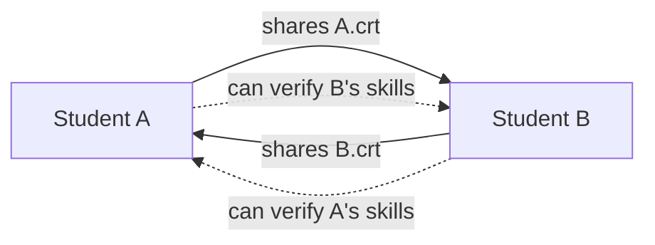
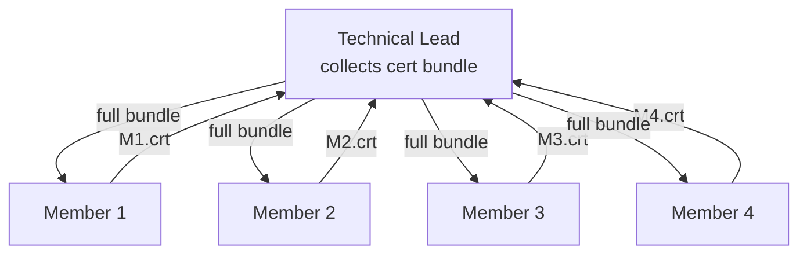
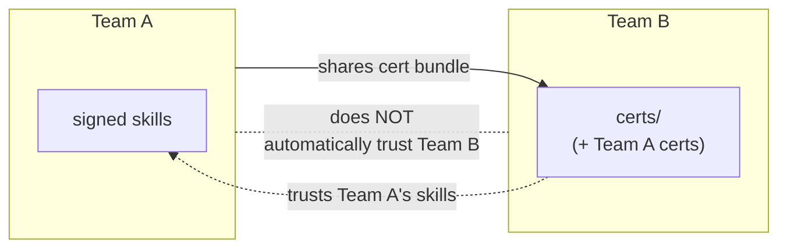
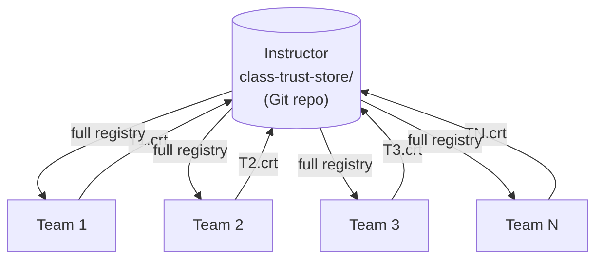
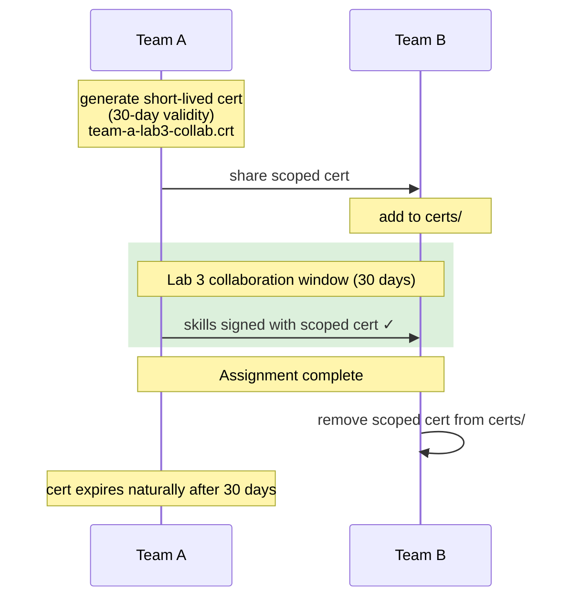

# Ad-Hoc Trust Groups with Free2PA
### How Student Teams Can Establish, Share, and Govern Credential Trust Without a Central Authority

---

## Abstract

Free2PA signs AI agent skill files and verifies them against a local certificate trust store. By default, the trust store is controlled by a single server operator. This paper explores how students and teams can extend that model to form **ad-hoc trust groups** — small, self-organizing networks where participants decide for themselves whose skills to trust, without requiring a central authority to issue or approve certificates. We describe five trust group patterns suited to the class environment, the mechanics of executing each one with today's Free2PA tooling, and the governance and security principles that make these groups meaningful rather than ceremonial.

---

## 1. The Problem: Trust Stops at the Team Boundary

In place of "no" trust model, each team can run its own Free2PA server and maintains its own `certs/` trust store. A team can sign its own skills and verify them internally without any friction. But the moment a team wants to use a skill built by another team — or wants to allow another team's MCP server to verify one of their skills — there is no mechanism for that. The trust stores are isolated silos.

This is not just a technical gap. It reflects a real question every multi-team agentic system has to answer: **how do independent parties establish enough mutual trust to safely share executable code?**

In the physical world, trust groups form constantly and informally: colleagues share tools, businesses exchange APIs under contracts, researchers cite each other's work. The question is how to replicate that social process cryptographically, at a small scale, without turning into a bureaucracy.

Free2PA's certificate model — where trust is simply "does this cert appear in my trust store?" — is deliberately minimal. That minimalism is also what makes ad-hoc trust groups possible. You do not need a certificate authority, a trust registry, or an approval workflow. You just need to exchange public certificates and decide, explicitly, whose you will keep.

---

## 2. Review: How Free2PA Trust Works

When a skill file is signed, the signing certificate (the public half — the `.crt` file) is embedded directly in the sidecar manifest. The private key never leaves the signer.

When a skill is verified under the **Server/Dev trust profile**:

- **Without a cert selected:** the verifier scans every `.crt` file in its `certs/` directory. If any of them matches the cert in the sidecar, the skill is trusted.
- **With a specific cert selected:** the verifier checks only against that cert. This is a strict identity check — "was this skill signed by this specific issuer?"

This means **the trust store is the trust policy**. Whoever controls what goes into `certs/` controls what gets trusted. That is both the power and the responsibility of the model.

---

## 3. The Key Insight: Certs Are Safe to Share

A critical property of public-key cryptography is that the public certificate reveals nothing that can be used to forge a signature. You cannot sign anything with a `.crt` file — you need the corresponding `.key` file, which never leaves the signer's machine.

This means **sharing your `.crt` file is always safe**. You can post it in a GitHub repo, attach it to an email, embed it in a class handout, or serve it over HTTP. Anyone who has your cert can:

- Verify that a skill was signed by you
- Add your cert to their trust store so their verifier or MCP server recognizes your skills

What they cannot do:
- Sign anything in your name
- Impersonate you
- Derive your private key

This property is what makes ad-hoc trust groups practical. Establishing trust between two parties is as simple as exchanging files.

---

## 4. Five Trust Group Patterns

### Pattern 1 — Pair Trust

**Scenario:** Two students collaborate on a joint skill. They want to sign and verify each other's contributions.

**Setup:**
1. Each student generates a cert in their Free2PA instance (Sign panel → Generate New Certificate).
2. Each student exports their `.crt` file and gives it to the other.
3. Each student drops the other's `.crt` into their own `certs/` directory.
4. Either student can now verify a skill signed by the other — without selecting a specific cert, since the trust store scan will find the match automatically.



**What this proves:** "This skill was signed by someone I explicitly chose to trust."

**Who manages the trust relationship:** Both parties equally. Either can revoke trust by removing the other's cert.

---

### Pattern 2 — Team Trust Ring

**Scenario:** A 4–6 person team (Technical Lead, Skills Development Lead, MCP and Tooling Lead, etc.) wants any team member to be able to sign skills that any other member can verify. A reviewer should not have to know which specific teammate signed a given skill — only that it came from within the team.

**Setup:**
1. Every member generates their own cert.
2. The Technical Lead collects all member `.crt` files into a shared folder (a Git repo, a shared drive, a course submission portal — any channel works).
3. Every member downloads the full collection and adds all certs to their `certs/` directory.
4. Verification is now team-wide: any member's sidecar passes the trust check on any member's verifier, because the trust store contains everyone.



**What this proves:** "This skill was signed by a member of my team."

**The MCP and Tooling Lead's role:** This is exactly the kind of infrastructure this role owns. Maintaining the team cert registry, ensuring all members have current certs, and deciding the process for adding or removing members is a natural MCP tooling responsibility.

**What this does not prove:** Which specific team member signed it. For that, a verifier would need to select a specific cert. The two-mode design of Free2PA (scan all vs. match specific) supports both needs in the same tool.

---

### Pattern 3 — Cross-Team Trust (Unidirectional)

**Scenario:** Team A has built a high-quality discovery interview skill. Team B wants to use it in their agent pipeline. Team B's MCP server should accept skills signed by Team A, but Team A does not necessarily need to trust Team B's skills.

**Setup (Team B's MCP Lead does this):**
1. Team B's MCP Lead requests Team A's cert bundle (the collection of Team A member certs).
2. Team B adds Team A's certs to their own trust store.
3. No action required on Team A's side.

This is **unidirectional trust**: Team B trusts Team A, but not vice versa. It is asymmetric by design. In agentic systems, a consuming team does not automatically earn trust just because they trust the producer.



**Escalation:** If Team B wants Team A to trust them back, they initiate the same exchange in the other direction. Bilateral trust requires two explicit decisions.

**What this proves:** "This skill came from a team we have explicitly decided to trust."

---

### Pattern 4 — Class-Wide Trust (Instructor-Mediated)

**Scenario:** The instructor wants all student teams to be able to verify each other's skills — for peer review, cross-team testing, or portfolio evaluation. Rather than every team exchanging certs with every other team (which scales poorly), the instructor maintains a canonical trust registry.

**Setup:**
1. The instructor creates a `class-trust-store/` repository — a public or shared Git repo containing the `.crt` file for every student or team in the class.
2. Teams clone or pull from this repo and copy its contents into their `certs/` directory.
3. Any skill signed by any class member now passes the trust check for any other class member.



**The instructor's role:** The instructor acts as a **trust registrar** — not a certificate authority (they do not issue or sign certs), but a curator who decides which certs belong in the registry. A student whose work fails to meet integrity standards can be removed from the registry, effectively revoking their trust across the entire class without touching any individual's trust store.

**Update cadence:** At the start of each week or assignment, teams pull the latest registry. New students or teams added mid-semester are included automatically in the next pull.

**What this proves:** "This skill was produced by a member of this class, as recognized by the instructor."

---

### Pattern 5 — Scoped / Temporal Trust

**Scenario:** Team A wants to collaborate with Team B on a specific lab assignment, but does not want to maintain a permanent trust relationship. After the assignment is complete, the trust should expire naturally.

**Setup:**
1. Team A generates a **short-lived cert** specifically for this collaboration (e.g., 30-day validity). Name it something meaningful: `team-a-lab3-collab.crt`.
2. Team A shares this cert with Team B. Team B adds it to their trust store.
3. Skills signed with this cert will pass Team B's trust check during the assignment window.
4. After 30 days, the cert expires. Verification will still technically work (the cert is still in the trust store), but the expiry date is visible in the verdict detail.
5. After the assignment, either party can remove the scoped cert from their trust store, cleanly terminating the trust relationship.



**What this proves:** "This skill was signed by Team A specifically for this collaboration."

**Why this matters:** Permanent trust accumulates silently. Scoped certs make the trust relationship explicit and bounded. If you have to generate a new cert for each collaboration, you have to make a conscious decision each time — which is the right posture for security-sensitive tool sharing.

---

## 5. Mechanics: How to Execute This Today

Free2PA supports the complete trust group workflow from the browser UI. No filesystem access or command-line steps are required for any of the five patterns.

### Exporting your cert

In the **Sign panel**, select your certificate from the dropdown and click the **⬇** button next to it. Your `.crt` file downloads immediately. This is the file you share with peers who want to trust your skills.

Your cert is also embedded in every sidecar you sign — the `signature.cert_pem` field in the `.c2pa.json` contains the full PEM. Anyone with a sidecar can extract your cert from it. It is also visible in the Claim JSON panel at the bottom of the Verify screen after any successful verification.

### Importing a peer cert

In the **Sign panel**, click **+ Import Certificate(s)** to expand the import section. Drop the `.crt` file you received from your peer onto the drop zone (or click to choose it). Optionally type a name in the **Save as** field — this becomes the filename in `certs/`. Click **Import Certificate(s)**.

Free2PA validates the file is a real X.509 certificate before saving it. The cert appears immediately in both the Sign and Verify cert dropdowns and is included in the trust store scan on the next verification.

### Importing a team bundle

The same import section accepts multiple `.crt` files at once. Drop the entire cert collection — or select all files with Ctrl/Cmd+click in the file picker. Each cert is validated and saved individually. The results list shows which imported successfully and which failed.

This is the primary mechanism for Pattern 2 (team trust ring) and Pattern 4 (class-wide trust): the Technical Lead or instructor assembles a cert bundle, and each member imports the whole bundle in one drop.

### Sharing your cert via GitHub

The cleanest approach for a team is a dedicated certs repo or a `certs/` directory in your team repo. Since `.key` files must never be committed, the `.gitignore` for the Free2PA project already excludes them. Only `.crt` files are safe to commit — and that is all your peers need.

```
team-a-skills/
└── certs/
    ├── jkilroy.crt
    ├── asmith.crt
    └── mwilson.crt
```

A peer who downloads these files can import them all at once using the bundle import in the UI. No command-line steps required.

---

## 6. Trust Group Governance

Forming a trust group is a social decision expressed through a technical mechanism. The mechanism is simple — add a cert. The decision requires more thought.

### Questions to answer before adding a cert

- **Who controls the private key for this cert?** If one person has the key, they speak for the entire cert. If the key is on a shared server, everyone with server access speaks for it.
- **What scope does this trust cover?** Are you trusting this cert for all skills, or only skills submitted to a specific course or assignment?
- **What is the revocation process?** If someone in the group violates trust — submits a skill they didn't write, or modifies a skill after signing — how does the group remove their cert and invalidate their claims?
- **How long should this trust last?** A permanent cert for a semester-long partner is appropriate. A permanent cert for someone you worked with once is probably too much.

### Revocation

Free2PA revocation is immediate and unilateral: delete the cert file from `certs/`. The next verification of any skill signed by that cert will fail the trust check. No coordination is required. No certificate revocation list needs to be updated. This is one of the advantages of filesystem-based trust stores.

However, revocation does not retroactively invalidate skills that have already been accepted and loaded by a running agent. For running systems, additional controls (skill version pinning, agent restart policies) are needed at the MCP layer.

---

## 7. Connection to MCP Trust Gating

When Free2PA moves to an MCP server implementation, these trust group patterns map directly to deployment configurations:

| Trust Group Pattern | MCP Configuration |
|---|---|
| Pair trust | Each MCP server's `certs/` contains the partner's cert |
| Team trust ring | MCP server's `certs/` contains all team member certs |
| Cross-team trust | Consuming team's MCP server adds producing team's certs |
| Class-wide trust | MCP server's `certs/` is populated from the class registry |
| Scoped trust | Short-lived cert added; removed after assignment deadline |

An MCP server configured with a team trust ring will automatically accept any skill signed by any team member and reject skills from outside the group. The trust policy is the directory contents — no code changes required to add or remove a trusted issuer.

This also means **the MCP and Tooling Lead on each team owns the trust policy for that team's agent pipeline**. Managing `certs/` is a security-critical infrastructure task, not an afterthought. The team role matrix should reflect that: the MCP Lead's weekly deliverable should include a trust store audit — which certs are present, which have been added or removed, and why.

---

## 8. A Web of Trust, Not a Hierarchy

The five patterns above form a **web of trust** rather than a hierarchy. No one cert is inherently more trusted than another. The instructor's cert is trusted by students because students chose to add it — not because the cryptographic system grants it special authority. A team lead's cert is no more powerful than a team member's cert unless the team deliberately creates that asymmetry (e.g., by only including the lead's cert in an external-facing bundle).

This is by design. Hierarchical trust (certificate authorities, root stores) is appropriate for public-scale systems where you cannot know every issuer personally. At the scale of a class, a team, or a small organization, flat web-of-trust models are simpler to reason about, easier to audit, and less brittle when central authorities become unavailable.

The tradeoff is that flat models require more explicit decision-making. Every cert that enters a trust store represents a decision someone made. That is a feature, not a bug — in an agentic system, you want the humans in the loop to have made a conscious choice about every source of executable skill code.

---

## 9. Open Questions

The trust group model raises questions that Free2PA does not yet answer:

**How do you discover peers' certs?** Currently out-of-band (email, GitHub, shared drive). A simple cert discovery endpoint — `GET /api/certs/:id/public` — would let you share a URL instead of a file.

**How do you verify a cert came from who you think it came from?** Free2PA has no identity binding. A cert named `jkilroy.crt` could have been generated by anyone. The binding between a cert and a real identity currently depends on social trust (you received it directly from the person) or institutional trust (the instructor published it). A student ID field in the cert's subject would help — Free2PA's certificate generator already supports arbitrary Common Names and Organization names, so convention could carry this.

**What happens when a key is compromised?** If someone's signing key is stolen or leaked, any skill they signed becomes untrustworthy — but there is no mechanism to signal this to trust stores that have already added their cert. Certificate revocation lists (CRLs) or Online Certificate Status Protocol (OCSP) endpoints are the standard answer, but both require infrastructure. For now, compromised keys should be treated as a reason to remove the cert from all trust stores and re-sign all affected skills with a new key.

**Can trust be delegated?** In the current model, no. If Team A trusts Team B, and Team B trusts Team C, Team A does not automatically trust Team C. This is correct behavior — transitive trust is how phishing works. Any expansion of trust scope requires an explicit human decision.

---

## 10. Conclusion

Ad-hoc trust groups are not a future feature of Free2PA — they are available today, using the trust store model already in place. What is needed is not new cryptography but new habits: the practice of treating cert exchange as a deliberate, documented, bounded act rather than a formality.

For student teams building AI agent skill pipelines, the practical recommendation is:

1. Every team maintains a cert bundle in their Git repo (public certs only).
2. The MCP and Tooling Lead owns the trust store and documents every addition and removal.
3. Trust is scoped to assignments where possible, using short-lived certs.
4. Cross-team trust requires explicit bilateral decisions, logged in the weekly packet.
5. The instructor publishes and maintains a class-wide cert registry for peer review workflows.

When Free2PA moves to MCP integration, these habits become the policy engine for automated trust gating. The teams that have internalized the model will be able to configure their MCP servers correctly from the start, because they will understand that the trust store is not a technical artifact — it is a record of every trust decision the team has made.

---

*Free2PA v0.1.0 — Friends of Justin*
